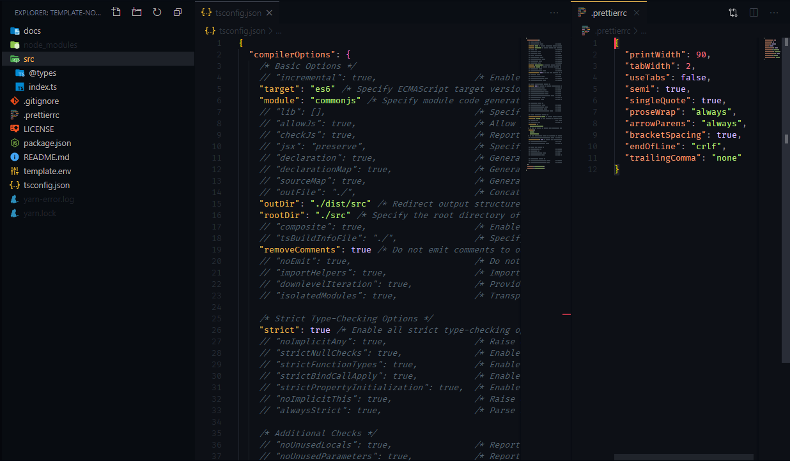

# social-bot

[](https://linkedin.com/in/edixonalberto)
[](./LICENSE.md)


Social bot basic created with nodejs + typescript

### Get Started

Crete file `.env` and add the environment.

```sh
cp .env/template.env .env
```

Install dependencies and start.

```sh
yarn install

yarn start:dev # to development
```

<!-- ### Screenshots

 -->
